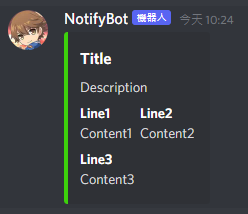

# Discord Notify Bot

Discord Notify Bot

[中文版說明](./README_tc.md)

Receive and send Discord messages, you can combine with other systems to achieve real time notifying.

# Requirement

Python 3.7+

# Environment(.env)

```bash
# Web Server
WEB_PORT= Listen port
WEB_USER= Authorized user
WEB_PASSWORD= Authorized password

# Discord Bot
BOT_TOKEN= Discord BotToken
```

For applying Discord Bot account, please follow [official tutorial](https://discordpy.readthedocs.io/en/stable/discord.html)

# Launch

```bash
python main.py # Debug mode

python -O main.py # Normal mode

python -O main.py --daemon # Daemon Mode(no interactive shell, suitable for running in backgorund)
```

# API

## Get Channels

`GET http://{IP:PORT}/get_channels`

+ Request method

    | Request methods/headers  | Value
    |--------------------------|----
    | Method                   | GET
    | Authorization            | Basic

+ Request parameters

    None

+ Response

    ```json
    {
        "data": {
            "server": [
                "channel 1",
                "channel 2"
            ]
        },
        "success": true
    }
    ```

## Get Members

`GET http://{IP:PORT}/get_members`

+ Request method

    | Request methods/headers  | Value
    |--------------------------|----
    | Method                   | GET
    | Authorization            | Basic

+ Request parameters

    None

+ Response

    ```json
    {
        "data": {
            "server": [
                "member 1",
                "member 2",
                "member 3"
            ]
        },
        "success": true
    }
    ```

## Send Text

`POST http://{IP:PORT}/send_text`

+ Request method

    | Request methods/headers  | Value
    |--------------------------|----
    | Method                   | POST
    | Authorization            | Basic
    | Content-Type             | application/json

+ Request parameters

    Send to Member

    - specify name

    ```json
    {
        "user": "member 1",
        "message": "Hello World"
    }
    ```

    - specify ID

    ```json
    {
        "user": 804285680658284565,
        "message": "Hello World"
    }
    ```

    Send to Channel

    - specify name

    ```json
    {
        "guild": "server",
        "channel": "channel",
        "message": "Hello World"
    }
    ```

    - specify ID

    ```json
    {
        "guild": 908285907893895178,
        "channel": 908285907893895181,
        "message": "Hello World"
    }
    ```

+ Response

    ```json
    {
        "data": null,
        "success": true
    }
    ```
    

## Send Embed Message

`POST http://{IP:PORT}/send_embed`

+ Request method

    | Request methods/headers  | Value
    |--------------------------|----
    | Method                   | POST
    | Authorization            | Basic
    | Content-Type             | application/json

+ Request parameters

    Send to Member

    ```json
    {
        "user": "member",
        "message": {
            "title": "Title",
            "description": "Description",
            "color": "0x3CD10C",
            "fields": [
                {"name": "Line1", "value": "Conten1", "inline": false},
                {"name": "Line2", "value": "Conten2", "inline": false},
                {"name": "Line3", "value": "Conten3", "inline": false}
            ]
        }
    }
    ```

    Send to Channel

    Same as `send_text`

+ Response

    ```json
    {
        "data": null,
        "success": true
    }
    ```

     

# Tag

You can tag users when sending message, only following fields can be recognized

| API           | Fields
|---------------|----
| send_text     | message
| send_embed    | description, fields.value

Supported tags

1. @here

    `"@here Hello World"`

2. @everyone

    `"@everyone Hello World"`

3. @memeber

    `"<@memeber> Hello World"`

    `"<@804285680658284565> Hello World"`

# Example

Followings are `Linux shell script`, for pure python scripts you can check tests folder

## Get Members

```bash
#!/bin/sh
auth_key=user:password
auth_key_encoded=$(echo -n "$auth_key" | base64)

get_url=http://127.0.0.1:5000/get_members

response=$(curl -X GET $get_url -H "Authorization: Basic $auth_key_encoded")

echo $response
```

## Send Text

```bash
#!/bin/sh
auth_key=user:password
auth_key_encoded=$(echo -n "$auth_key" | base64)

post_url=http://127.0.0.1:5000/send_text

user=member
msg="Hello World"

curl -X POST $post_url \
	-H "Content-Type: application/json" -H "Authorization: Basic $auth_key_encoded" \
	-d "{
			\"user\": \"$user\",
			\"message\":\"$msg\"
	}"
```

## Send Embed Message

```bash
#!/bin/sh
auth_key=user:password
auth_key_encoded=$(echo -n "$auth_key" | base64)

post_url=http://127.0.0.1:5000/send_embed

user=member
title=Title
description=Desciption
color=0x3CD10C

fields[0]="Line1 Content1"
fields[1]="Line2 Content2"
fields[2]="Line3 Content3"

# use python to generate json
script=$(echo -n "
import json

dic = {}
dic[\"user\"] = \"$user\"

message = {}
dic[\"message\"] = message
message[\"title\"] = \"$title\"
message[\"description\"] = \"$description\"
message[\"color\"] = \"$color\"

fields = []
message[\"fields\"] = fields
$(
    for i in "${fields[@]}"
    do
        values=($i)
        echo "fields.append({\"name\":\"${values[0]}\", \"value\":\"${values[1]}\", \"inline\":False})"
    done
)

print(json.dumps(dic, ensure_ascii=False, indent=4))
")
content=$(python -c "$script")

curl -X POST $post_url \
	-H "Content-Type: application/json" -H "Authorization: Basic $auth_key_encoded" \
	-d "$content"
```