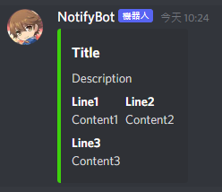

# Discord Notify Bot

Discord通知機器人

接收並發送Discord訊息，可與其他系統介接，實現實時訊息通知。

# 需求

Python 3.7+

# 設定檔(.env)

```bash
# Web Server
WEB_PORT= 監聽端口
WEB_USER= 授權使用者
WEB_PASSWORD= 授權密碼

# Discord Bot
BOT_TOKEN= Discord機器人Token
```

Discord機器人帳號，請參照[官方教學](https://discordpy.readthedocs.io/en/stable/discord.html)申請

# 啟動

```bash
python main.py # Debug啟動

python -O main.py # 一般啟動

python -O main.py --daemon # 服務模式啟動(不啟用指令交互，適合背景執行)
```

# API

## 取得所有頻道

`GET http://{IP:PORT}/get_channels`

+ 請求方法

    | 請求方法/標頭  | 值
    |---------------|----
    | 方法          | GET
    | Authorization | Basic認證

+ 請求參數

    無

+ 回傳

    ```json
    {
        "data": {
            "server": [
                "channel 1",
                "channel 2"
            ]
        },
        "success": true
    }
    ```

## 取得所有成員

`GET http://{IP:PORT}/get_members`

+ 請求方法

    | 請求方法/標頭  | 值
    |---------------|----
    | 方法          | GET
    | Authorization | Basic認證

+ 請求參數

    無

+ 回傳

    ```json
    {
        "data": {
            "server": [
                "member 1",
                "member 2",
                "member 3"
            ]
        },
        "success": true
    }
    ```

## 傳送一般訊息

`POST http://{IP:PORT}/send_text`

+ 請求方法

    | 請求方法/標頭  | 值
    |---------------|----
    | 方法          | POST
    | Authorization | Basic認證
    | Content-Type  | application/json

+ 請求參數

    傳給成員

    - 指定名稱

    ```json
    {
        "user": "member 1",
        "message": "Hello World"
    }
    ```

    - 指定ID

    ```json
    {
        "user": 804285680658284565,
        "message": "Hello World"
    }
    ```

    傳給頻道

    - 指定名稱

    ```json
    {
        "guild": "server",
        "channel": "channel",
        "message": "Hello World"
    }
    ```

    - 指定ID

    ```json
    {
        "guild": 908285907893895178,
        "channel": 908285907893895181,
        "message": "Hello World"
    }
    ```

+ 回傳

    ```json
    {
        "data": null,
        "success": true
    }
    ```

    

## 傳送embed訊息

`POST http://{IP:PORT}/send_embed`

+ 請求方法

    | 請求方法/標頭  | 值
    |---------------|----
    | 方法          | POST
    | Authorization | Basic認證
    | Content-Type  | application/json

+ 請求參數

    傳給成員

    ```json
    {
        "user": "member",
        "message": {
            "title": "Title",
            "description": "Description",
            "color": "0x3CD10C",
            "fields": [
                {"name": "Line1", "value": "Conten1", "inline": false},
                {"name": "Line2", "value": "Conten2", "inline": false},
                {"name": "Line3", "value": "Conten3", "inline": false}
            ]
        }
    }
    ```

    傳給頻道

    與`send_text`改法一樣

+ 回傳

    ```json
    {
        "data": null,
        "success": true
    }
    ```

       

# 標記(tag)

傳送訊息時可以支援標記(tag)對象，只有以下欄位是可以識別的

| API           | 欄位
|---------------|----
| send_text     | message
| send_embed    | description, fields.value

支援的tag有3種

1. @here

    `"@here Hello World"`

2. @everyone

    `"@everyone Hello World"`

3. @成員

    `"<@成員> Hello World"`

    `"<@804285680658284565> Hello World"`

# 範例

以下為`Linux shell script`實作，python版本可以參考tests資料夾

## 取得所有成員

```bash
#!/bin/sh
auth_key=user:password
auth_key_encoded=$(echo -n "$auth_key" | base64)

get_url=http://127.0.0.1:6734/get_members

response=$(curl -X GET $get_url -H "Authorization: Basic $auth_key_encoded")

echo $response
```

## 傳送一般訊息

```bash
#!/bin/sh
auth_key=user:password
auth_key_encoded=$(echo -n "$auth_key" | base64)

post_url=http://127.0.0.1:6734/send_text

user=member
msg="Hello World"

curl -X POST $post_url \
	-H "Content-Type: application/json" -H "Authorization: Basic $auth_key_encoded" \
	-d "{
			\"user\": \"$user\",
			\"message\":\"$msg\"
	}"
```

## 傳送embed訊息

```bash
#!/bin/sh
auth_key=user:password
auth_key_encoded=$(echo -n "$auth_key" | base64)

post_url=http://127.0.0.1:6734/send_embed

user=member
title=Title
description=Desciption
color=0x3CD10C

fields[0]="Line1 Content1"
fields[1]="Line2 Content2"
fields[2]="Line3 Content3"

# use python to generate json
script=$(echo -n "
import json

dic = {}
dic[\"user\"] = \"$user\"

message = {}
dic[\"message\"] = message
message[\"title\"] = \"$title\"
message[\"description\"] = \"$description\"
message[\"color\"] = \"$color\"

fields = []
message[\"fields\"] = fields
$(
    for i in "${fields[@]}"
    do
        values=($i)
        echo "fields.append({\"name\":\"${values[0]}\", \"value\":\"${values[1]}\", \"inline\":False})"
    done
)

print(json.dumps(dic, ensure_ascii=False, indent=4))
")
content=$(python -c "$script")

curl -X POST $post_url \
	-H "Content-Type: application/json" -H "Authorization: Basic $auth_key_encoded" \
	-d "$content"
```